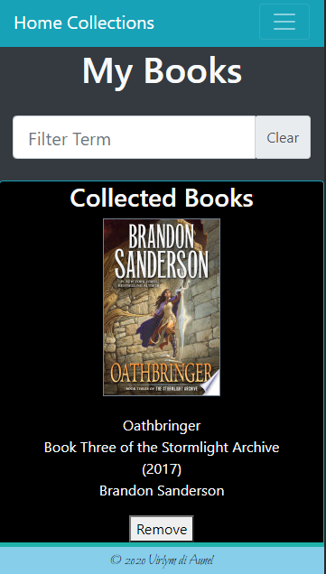

# **home-collections**
  
  
  
  ## **Description**
  A Web App designed to help people keep track of their entertainment media. While you need to be logged in to save media to your collection, you can always just utilize the search engines to browse through what the APIs can find. The Book Search leverages the Google Books API to find books by title, author, publisher, subject, isbn, or just a generic search. The Movie Search leverages the OMDB API to find movies or TV series. The Music Search leverages the Spotify API to find albums by artist, album, or track title.

  The App is built utilizing React and utilizes a MySQL database to store user collections. It also uses Bootstrap and React Bootstrap for styling, React Helmet for background color, Axios for API calls, and React Router Dom for page linking. Email verification utilizes MailJS to send the templated emails to users.
  <br><br>
  
  ## **Table of Contents**
  
  * [Installation](#Installation)
  * [Usage](#Usage)
  * [License](#License)
  * [Contributing](#Contributing)
  * [Technology](#Technology)
  * [Questions](#Questions)
  
  <br><br>
  
  ## **Installation**
  
  1. Clone the repo
  ```sh
  git clone https://github.com/virlym/home-collections.git
  ``` 
  2. Install NPM packages
  ```sh
  npm install
  ```
  <br><br>
  
  ## **Usage**
  [Deployed link](https://home-collections.herokuapp.com/)

  **A desktop view of the landing page:**

  

  **Mobile (Galaxy S5) view of the search and collection pages:**

  
  
  
  
  
  

  **Mobile (Galaxy S5) view of the login page**

  
  <br><br>
  
  ## **License**
  
  Distributed under the MIT License.
  <br><br>
  
  ## **Contributing**
  Contributions are what make the open source community such an amazing place to be learn, inspire, and create. Any contributions you make are **greatly appreciated**.
  
  1. Fork the Project
  2. Create your Feature Branch (`git checkout -b feature/AmazingFeature`)
  3. Commit your Changes (`git commit -m 'Add some AmazingFeature'`)
  4. Push to the Branch (`git push origin feature/AmazingFeature`)
  5. Open a Pull Request
  
  <br><br>
  
  ## **Technology**
  - [JavaScript](https://www.javascript.com/)
  - [React.js](https://reactjs.org/)
  - [Google Books API](https://developers.google.com/books)
  - [OMDB API](http://www.omdbapi.com/)
  - [Spotify API](https://developer.spotify.com/documentation/web-api/)
  - [npm Axios](https://www.npmjs.com/package/axios)
  - [React Router](https://reactrouter.com/web/guides/quick-start)
  - [npm React Helmet](https://www.npmjs.com/package/react-helmet)
  - [EmailJS](https://www.emailjs.com/docs/)
  <br><br>
  
  ## **Questions**
  Learn about more of my work at [my GitHub](https://github.com/virlym)
  
  You can send any additional questions to my email : virlym@gmail.com